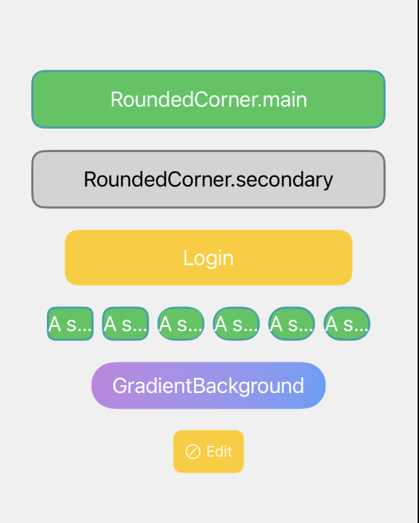

# JCSwiftUIWedgets

[](https://travis-ci.org/James/JCSwiftUIWedgets)
[](https://cocoapods.org/pods/JCSwiftUIWedgets)
[](https://cocoapods.org/pods/JCSwiftUIWedgets)
[](https://cocoapods.org/pods/JCSwiftUIWedgets)

## Introduction

Here are three frameworks for junior developers. They can help you increase development efficiency and write more standardized, maintainable code.:

[JCSwiftCommon](https://github.com/infila/JCSwiftCommon): for extensions, some common function, and a lightweight local storage tool based on file system IO.

[JCSwiftRestful](https://github.com/infila/JCSwiftRestful): for Restful APIs. It helps you focus more on handling object-oriented and structured data. To use this framework, you will have to write code using more standard RESTful semantics, both on iOS and server sides. Otherwise, the automatic serialization and deserialization functions within this framework will not work.

[JCSwiftUIWedgets](https://github.com/infila/JCSwiftRestful): contains some custom components. Since many native SwiftUI methods do not support iOS 13 or 14, I have written some components to support these versions. And all components support "theme mode", which meaning you only need to modify one config, and the appearance will change everywhere.

## Example

### JCButtonStyle

</img>

2 steps to make a customized ButtonStyle, and apply:
* Step 1, add an extension like: 
```ruby
extension JCButtonStyle.FixedSizeRounded {
  static let smallYellow = JCButtonStyle.FixedSizeRounded(
    width: 66,
    height: 40,
    cornerRadius: 8,
    textFont: JCThemeFont.shared.S,
    textColor: JCColorPair(normal: .white, highlight: .white),
    backgroundColor: JCColorPair(normal: .yellow, highlight: .yellow.opacity(0.5)),
    strokeColor: JCColorPair(normal: .yellow, highlight: .orange)
  )
}
```

* Step 2, applying:
```ruby
Button("Button") {
  print("Button Clicked")
}
.buttonStyle(JCButtonStyle.FixedSizeRounded.smallYellow)
```

or applying on A HStack with a icon and a title:
```ruby
HStack(spacing: 4) {
  Image(systemName: "pencil.circle")
  Text("Edit")
}
.buttonWrapped {
  print("Button Clicked")
}
.buttonStyle(JCButtonStyle.FixedSizeRounded.smallYellow)
```

** You can find more examples in each file's #Preview{}.**

## Requirements

iOS Deployment Target >= 13.0 

## Installation

JCSwiftUIWedgets is available through [CocoaPods](https://cocoapods.org). To install
it, simply add the following line to your Podfile:

```ruby
pod 'JCSwiftUIWedgets'
```

## Author

James, infilachen@gmail.com, [LinkedIn](https://www.linkedin.com/in/jameschen5428)

Fanny, fanfan.feng9@gmail.com

## License

JCSwiftUIWedgets is available under the MIT license. See the LICENSE file for more info.
